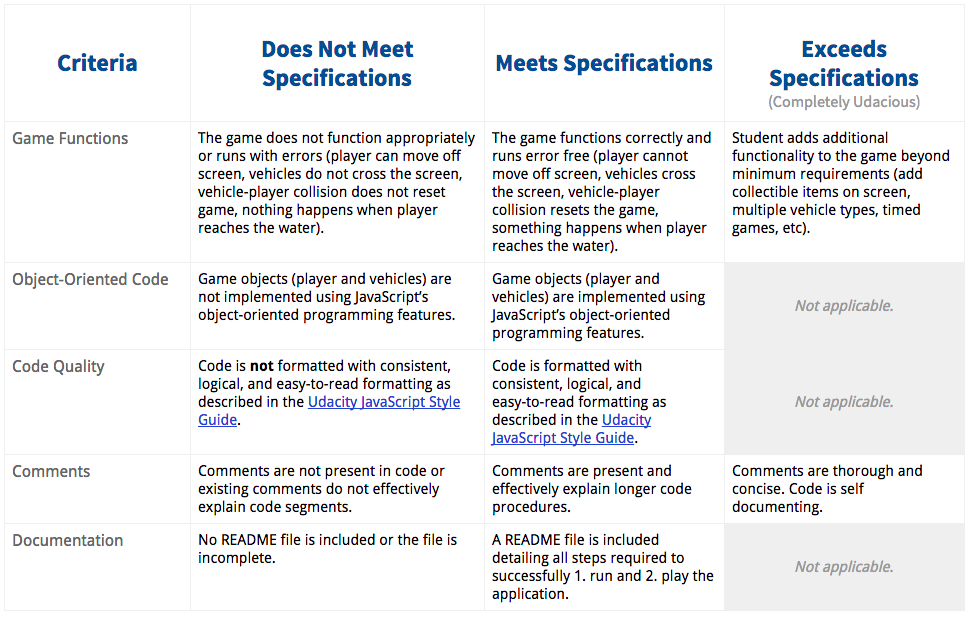

## Going one step further in project 3

<a href="https://plus.google.com/u/0/events/cupbs3pbne7qkuqok4g0ldhntic?authkey=COGW25b5jbv3-AE" target="_blank">
Office hours: Understanding the engine.js</a>

<a href="https://plus.google.com/u/0/events/cvfrgjulepond4pkkm1f3i8k820?authkey=CInxl-y4prCf2QE" target="_blank">
Student Showcase: 2 awesome asteroids games</a>

<a href="http://www.html5gamedevelopment.com/html5-game-tutorials/2013-06-5-part-html5-game-tutorial-galaxian-shooter" target="_blank">
HTML5 Game Tutorial: Galaxian Shooter</a>

<a href="http://gamedevelopment.tutsplus.com/tutorials/finite-state-machines-theory-and-implementation--gamedev-11867" target="_blank">
Finite-State Machines: theory and implementation</a>

<a href="http://www.html5rocks.com/en/tutorials/canvas/notearsgame/" target="_blank">
No Tears Guide to HTML5 Games</a>

<a href="https://www.udacity.com/course/html5-game-development--cs255" target="_blank">
Udacity course: HTML5 Game Development</a>

--------------------------------------------

### Some of the forums most useful threads

<a href="https://discussions.udacity.com/t/adding-sprites-to-canvas-background/28880" target="_blank">
Adding sprites to canvas background</a>

<a href="https://discussions.udacity.com/t/creating-multiple-enemy-instances/29406" target="_blank">
Creating multiple enemy instances</a>

<a href="https://discussions.udacity.com/t/finite-state-machine-to-model-game-states/21955" target="_blank">
Finite state machine to model game states</a>

---------------------------------------

### Free resources

<a href="http://www.lostgarden.com/" target="_blank">LostGarden.com</a>

<a href="http://opengameart.org/" target="_blank">OpenGameArt.org</a>

<a href="http://hasgraphics.com/" target="_blank">HasGraphics.com</a>

<a href="http://www.freesound.org/" target="_blank">FreeSound.org</a>

<a href="http://game-icons.net/" target="_blank">Game-Icons.net</a>

----------------------------------------------------

### Evaluation rubric

